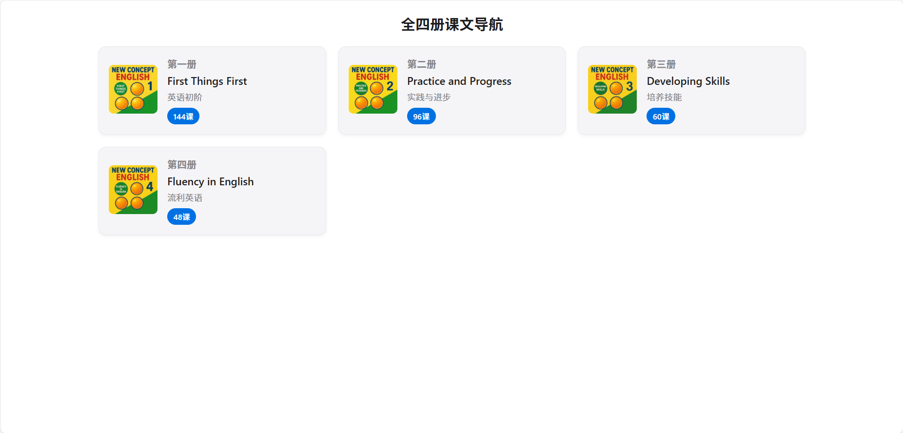
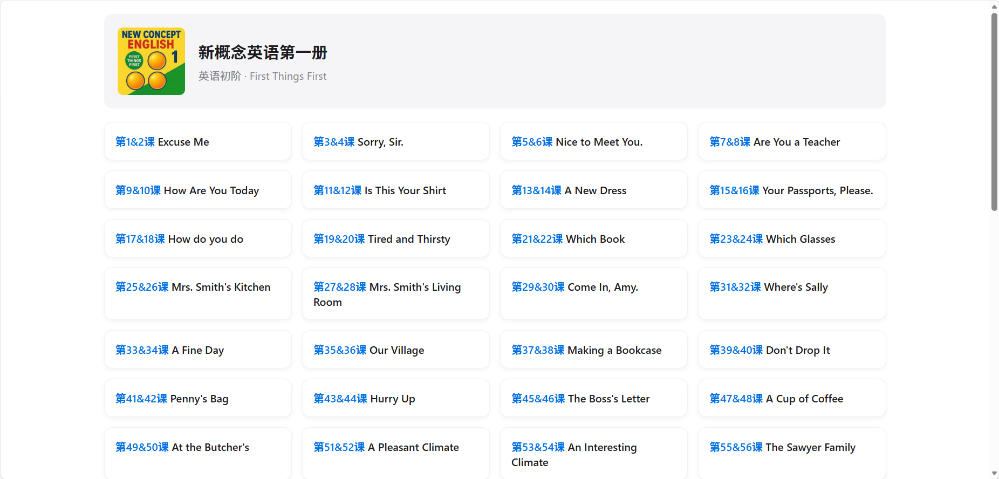
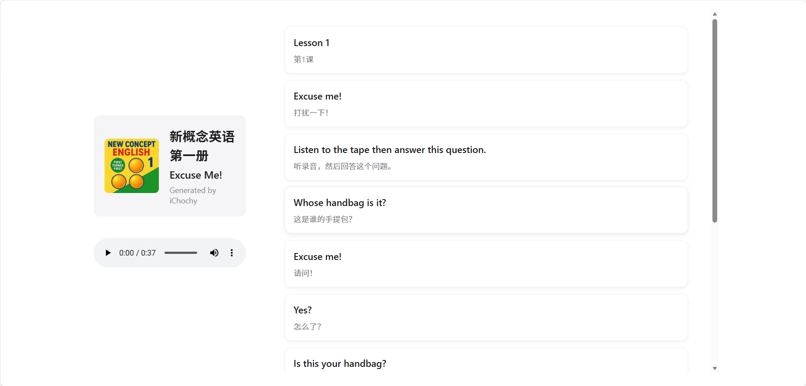

# 新概念英语点读系统（个人优化版）

  <a href="http://nce.ichochy.com"><strong>原项目演示 »</strong></a>
   
   
  <a href="#功能特性">功能特性</a>
  ·
  <a href="#新概念英语全四册介绍">教材介绍</a>
  ·
  <a href="#版权声明">版权声明</a>

这是一个基于 [ichochy/nce](https://github.com/ichochy/nce) 项目的 fork 版本，我对原始代码进行了界面优化和交互改进，以满足个人使用需求。

## 功能特性

- 🎧 单句点读功能：点击任意句子即可单独播放
- 📖 中英对照显示：原文与译文清晰对应
- 🖥️ 响应式设计：适配桌面端和移动端浏览
- 🎨 界面优化：现代化设计风格，更好的视觉体验
- ⚡ 交互改进：更直观的操作流程和用户体验

## 技术架构

- 纯静态网页实现，无需后端服务
- HTML5 + CSS3 + JavaScript 实现
- Flexbox 布局，支持左右分栏（桌面端）和单列布局（移动端）
- 左侧固定宽度300px显示书籍信息，右侧自适应显示课文内容

## 界面预览

### 首页截图

### 课本导航截图

### 课本内容截图

## 新概念英语全四册介绍

### 📕 第一册：《First Things First》英语初阶

**目标**：打基础，日常交流入门

**适合人群**：英语零基础到初级学习者

详细信息

* **内容概述**：
  * 共144课，都是非常短的小对话和故事
  * 涉及**字母、音标、基础词汇、简单句型**
  * 场景包括：问候、介绍、买东西、问路、看医生、日常生活

* **语法重点**：
  * 一般现在时、一般过去时、一般将来时的基本用法
  * be动词、名词单复数、冠词、简单疑问句、祈使句

* **词汇量**：约600词左右

* **学习重点**：
  * 正确发音、掌握基础语法、能听懂并说出日常用语
  

---

### 📘 第二册：《Practice and Progress》实践与进步

**目标**：初步运用，听说读写同步提高

**适合人群**：有一定英语基础，想系统梳理语法、提高读写能力的人

详细信息

* **内容概述**：
  * 共96课，每课一个短故事，逐渐增加难度
  * 情节有趣，加入了旅行、工作、社会生活的情景

* **语法重点**：
  * 各种时态（现在完成时、过去完成时、将来时、过去进行时）
  * 被动语态、直接引语和间接引语、条件句、比较级和最高级

* **词汇量**：约1500词左右

* **学习重点**：
  * 掌握基本语法体系，能写简单短文，能听懂慢速英语
  * 口语表达更流畅，能描述事件、讲故事
  

---

### 📙 第三册：《Developing Skills》培养技能

**目标**：语言运用能力进阶，理解真实语境

**适合人群**：已学完第二册，想提高综合能力、能读懂原版书或新闻的人

详细信息

* **内容概述**：
  * 共60课，每课一篇短文，题材更丰富（科技、历史、人物、故事）
  * 文章更长，句子更复杂，阅读量明显加大

* **语法重点**：
  * 虚拟语气、各种复杂从句（定语从句、状语从句、名词性从句）
  * 非谓语动词（动词不定式、分词、动名词）的高级用法

* **词汇量**：约2500词左右

* **学习重点**：
  * 阅读理解能力，扩大词汇量，掌握地道表达
  * 能复述文章、用英语讨论话题、写中等长度的文章
  

---

### 📗 第四册：《Fluency in English》流利英语

**目标**：流利表达，学术/专业阅读能力

**适合人群**：已有较强英语基础，想进一步提升到高级水平的人

详细信息

* **内容概述**：
  * 共48课，每课一篇较长的文章，题材涵盖哲学、科学、艺术、历史
  * 语言地道、表达严谨，接近大学英语阅读难度

* **语法重点**：
  * 巩固所有语法，重点是复杂结构、修辞、长难句分析

* **词汇量**：约3500-4000词

* **学习重点**：
  * 提高逻辑思维和批判性阅读能力
  * 能写较长文章、报告，口语表达接近流利
  

---

## 🎯 学习路径建议

1. **第一册**：打好语音、语法和口语基础
2. **第二册**：建立完整语法体系，提升听说读写的基本能力
3. **第三册**：重点在阅读、词汇和句型复杂度，培养复述和写作能力
4. **第四册**：进入英语原著阅读和学术表达层面，达到准母语水平

## 个人优化说明

相比原版，我在以下几个方面进行了优化：

- **界面设计**：采用更现代化的设计语言，提升视觉效果
- **响应式布局**：优化移动端体验，确保在各种设备上都能良好显示
- **交互体验**：改进用户操作流程，使功能使用更加直观便捷
- **页面结构**：调整页面元素布局和间距，提升内容可读性

## 关于音频和翻译

- 音频为美音，来源于 [tangx/New-Concept-English](https://github.com/tangx/New-Concept-English)
- 中文字幕由 [Gemini AI](https://aistudio.google.com) 生成，未逐一核对，可能存在错误
- 使用了作者开发的 Python 脚本 [iGSTT](https://ichochy.com/posts/shell/20251015.html) 进行中文翻译处理

## 项目链接

- 原项目地址：[https://github.com/ichochy/nce](https://github.com/ichochy/nce)
- 音频资源：[https://github.com/tangx/New-Concept-English](https://github.com/tangx/New-Concept-English)
- 博客：[http://ichochy.com](http://ichochy.com)

## 版权声明

本网站的内容仅限个人学习、研究或欣赏之用，非商业用途。

内容源于互联网，我们不对内容的版权归属承担任何责任。  
如您认为本网站上的任何内容侵犯了您的著作权或其他合法权益，请通过以下联系方式通知我们。    
联系邮箱：me@ichochy.com。   
我们将在收到有效通知后尽快核实并采取相应措施（如删除相关内容）。  

为尊重和保护著作权人的合法权益，请您支持正版，购买合法授权的教材或资源，避免使用未经授权的内容。  

本声明适用于本网站的所有内容，感谢您的理解与配合。

## 学习寄语

1. Keep learning — progress comes with persistence.（坚持学习，每一天都有进步。）
2. Every new word brings you closer to the world.（每个新单词都是向世界迈进一步。）
3. English is the key to a broader stage.（英语是通向更广阔舞台的钥匙。）
4. Don’t fear mistakes — fear not speaking.（不怕说错，只怕不说。）
5. The power of language grows through practice.（语言的力量来自不断的练习。）
6. Let English become your new tool for thinking and expression.（让英语成为你思考与表达的新工具。）
7. Every time you speak, you build confidence.（每一次开口，都是自信的积累。）
8. Your effort will make English speak for you.（你的努力，会让英语为你发声。）
9. Learning English is not a task but a journey of discovery.（学习英语不是任务，而是探索世界的旅程。）
10. Be brave — speak out; you’re better than you think.（坚定一点，说出口，你比想象中更好。）