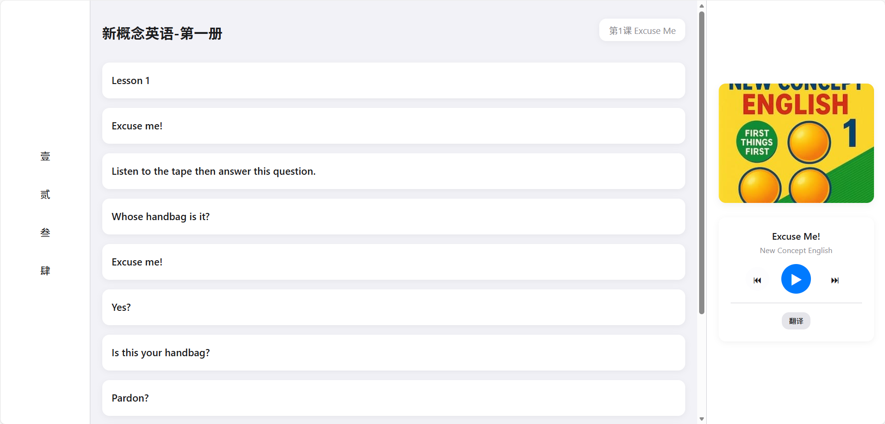
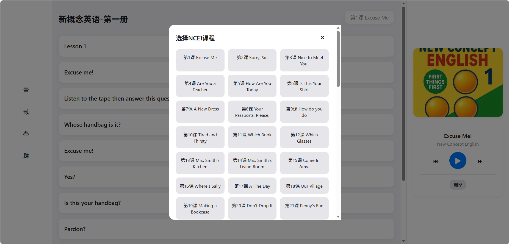

# 新概念英语点读系统（个人优化版）

<p align="center">
  <a href="http://nce.ichochy.com"><strong>原项目演示地址 »</strong></a>
  <br />
  <br />
  <a href="#功能特性">功能特性</a>
  ·
  <a href="#技术架构">技术架构</a>
  ·
  <a href="#界面预览">界面预览</a>
  ·
  <a href="#新概念英语全四册介绍">课本介绍</a>
  ·
  <a href="#版权声明">版权声明</a>
</p>

这是一个基于 [ichochy/nce](https://github.com/ichochy/nce) 项目的改进版本，提供了更好的用户界面和增强的功能。

## 功能特性

- 🎧 单句点读功能：点击任意句子即可单独播放
- 📖 中英对照显示：原文与译文清晰对应
- 🖥️ 响应式设计：完美适配桌面端和移动端浏览
- 🎨 现代化界面：采用现代化设计风格，提供更好的视觉体验
- ⚡ 流畅交互：支持键盘快捷键操作，更直观的操作流程
- 🔤 字幕高亮：正在播放的句子会自动高亮显示
- 📚 完整内容：涵盖新概念英语第一册至第四册全部课本
- 💾 本地存储：自动记住上次播放的课本

## 技术架构

- 纯静态网页实现，无需后端服务
- HTML5 + CSS3 + JavaScript 实现
- Flexbox 布局，支持左右分栏（桌面端）和单列布局（移动端）
- 左侧导航栏选择课本，中间主内容区显示课文，右侧控制面板显示书籍信息和控制按钮
- 使用 localStorage 存储上次播放的课本信息
- 支持键盘快捷键操作（空格键播放/暂停，左右箭头键上一句/下一句）

## 界面预览





## 操作说明

1. 使用左侧导航栏选择课本（NCE1-NCE4）
2. 点击课本后会弹出课本选择窗口，选择具体课本
3. 课本加载完成后，点击任意句子即可播放
4. 使用右侧控制面板的按钮或键盘快捷键控制播放
   - 空格键：播放/暂停
   - 左箭头键：上一句
   - 右箭头键：下一句
5. 点击"翻译"按钮切换中英文字幕显示

## 新概念英语全四册介绍

### 📕 第一册：《First Things First》英语初阶

**目标**：打基础，日常交流入门

**适合人群**：英语零基础到初级学习者

<details>
<summary>详细信息</summary>

* **内容概述**：
  * 共144课，都是非常短的小对话和故事
  * 涉及**字母、音标、基础词汇、简单句型**
  * 场景包括：问候、介绍、买东西、问路、看医生、日常生活

* **语法重点**：
  * 一般现在时、一般过去时、一般将来时的基本用法
  * be动词、名词单复数、冠词、简单疑问句、祈使句

* **词汇量**：约600词左右

* **学习重点**：
  * 正确发音、掌握基础语法、能听懂并说出日常用语
  </details>

---

### 📘 第二册：《Practice and Progress》实践与进步

**目标**：初步运用，听说读写同步提高

**适合人群**：有一定英语基础，想系统梳理语法、提高读写能力的人

<details>
<summary>详细信息</summary>

* **内容概述**：
  * 共96课，每课一个短故事，逐渐增加难度
  * 情节有趣，加入了旅行、工作、社会生活的情景

* **语法重点**：
  * 各种时态（现在完成时、过去完成时、将来时、过去进行时）
  * 被动语态、直接引语和间接引语、条件句、比较级和最高级

* **词汇量**：约1500词左右

* **学习重点**：
  * 掌握基本语法体系，能写简单短文，能听懂慢速英语
  * 口语表达更流畅，能描述事件、讲故事
  </details>

---

### 📙 第三册：《Developing Skills》培养技能

**目标**：语言运用能力进阶，理解真实语境

**适合人群**：已学完第二册，想提高综合能力、能读懂原版书或新闻的人

<details>
<summary>详细信息</summary>

* **内容概述**：
  * 共60课，每课一篇短文，题材更丰富（科技、历史、人物、故事）
  * 文章更长，句子更复杂，阅读量明显加大

* **语法重点**：
  * 虚拟语气、各种复杂从句（定语从句、状语从句、名词性从句）
  * 非谓语动词（动词不定式、分词、动名词）的高级用法

* **词汇量**：约2500词左右

* **学习重点**：
  * 阅读理解能力，扩大词汇量，掌握地道表达
  * 能复述文章、用英语讨论话题、写中等长度的文章
  </details>

---

### 📗 第四册：《Fluency in English》流利英语

**目标**：流利表达，学术/专业阅读能力

**适合人群**：已有较强英语基础，想进一步提升到高级水平的人

<details>
<summary>详细信息</summary>

* **内容概述**：
  * 共48课，每课一篇较长的文章，题材涵盖哲学、科学、艺术、历史
  * 语言地道、表达严谨，接近大学英语阅读难度

* **语法重点**：
  * 巩固所有语法，重点是复杂结构、修辞、长难句分析

* **词汇量**：约3500-4000词

* **学习重点**：
  * 提高逻辑思维和批判性阅读能力
  * 能写较长文章、报告，口语表达接近流利
  </details>

## 关于音频和翻译

- 音频为美音，来源于 [tangx/New-Concept-English](https://github.com/tangx/New-Concept-English)
- 中文字幕由 [Gemini AI](https://aistudio.google.com) 生成，未逐一核对，可能存在错误
- 使用了作者开发的 Python 脚本 [iGSTT](https://ichochy.com/posts/shell/20251015.html) 进行中文翻译处理

## 项目结构

```
.
├── NCE1/           # 第一册课本文件
├── NCE2/           # 第二册课本文件
├── NCE3/           # 第三册课本文件
├── NCE4/           # 第四册课本文件
├── images/         # 图片等资源
├── static/         # 静态资源目录
│   ├── data.json   # 课本索引文件
│   ├── script.js   # 主要功能脚本
│   └── style.css   # 样式文件
├── index.html      # 主页面
├── LICENSE         # 开源许可证
└── README.md       # 说明文档
```

## 使用方法

> 由于浏览器安全限制，需要启动HTTP服务器才能正确访问资源

1. 有两种启动方式：
    - 使用Python启动服务器：`python -m http.server 8000`
    - 或使用Node.js启动服务器：`npx serve .`
2. 在浏览器中访问 `http://localhost:8000` 
3. 点击左侧导航栏选择课本（壹/贰/叁/肆）
4. 在弹出的课本列表中选择具体课本
5. 点击句子即可播放对应音频
6. 使用控制面板或键盘快捷键控制播放

## 项目链接

- 原项目地址：[https://github.com/ichochy/nce](https://github.com/ichochy/nce)
- 音频资源：[https://github.com/tangx/New-Concept-English](https://github.com/tangx/New-Concept-English)

## 开源许可证

本项目采用 MIT 许可证，详情请参阅 [LICENSE](LICENSE) 文件。

## 版权声明

本网站的内容仅限个人学习、研究或欣赏之用，非商业用途。

内容源于互联网，我们不对内容的版权归属承担任何责任。

为尊重和保护著作权人的合法权益，请您支持正版，购买合法授权的教材或资源，避免使用未经授权的内容。  

本声明适用于本网站的所有内容，感谢您的理解与配合。

## 学习寄语

1. Keep learning — progress comes with persistence.（坚持学习，每一天都有进步。）
2. Every new word brings you closer to the world.（每个新单词都是向世界迈进一步。）
3. English is the key to a broader stage.（英语是通向更广阔舞台的钥匙。）
4. Don't fear mistakes — fear not speaking.（不怕说错，只怕不说。）
5. The power of language grows through practice.（语言的力量来自不断的练习。）
6. Let English become your new tool for thinking and expression.（让英语成为你思考与表达的新工具。）
7. Every time you speak, you build confidence.（每一次开口，都是自信的积累。）
8. Your effort will make English speak for you.（你的努力，会让英语为你发声。）
9. Learning English is not a task but a journey of discovery.（学习英语不是任务，而是探索世界的旅程。）
10. Be brave — speak out; you're better than you think.（坚定一点，说出口，你比想象中更好。）